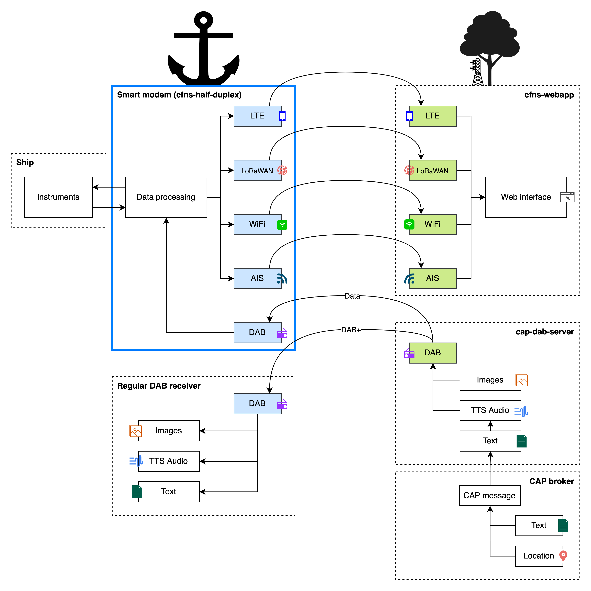

# Multi Connectivity: Half-Duplex

This project is part of the proof of concept Multi Connectivity. The purpose of this project is to validate
new DAB+ messages. With the contained data an acknowledgement needs to be send back with
the use of multiple wireless connections. For more information read the thesis (500770588-Afstudeerrapport-final.docx) on the OneDrive.

This application interfaces with dab-receiver, cap-dab-server and cfns-webapp.
See the diagram below.



## Features

Following features are provided

- Read provided devices and settings from devices.csv
- Observe folder for identifying new DAB+ message
- Read content of DAB+ message
- Sending acknowledgement by AIS, LoRaWAN and 4G, WiFi
- Supported interfaces: UART, I2C, Socket and SPI
- Share information from DAB+ messages on request using an interface
- Select the best technology to acknowledge DAB+ messages

## Requirements

### Libraries

- [Watchdog](https://pypi.org/project/watchdog/)
- [aisutils](https://github.com/schwehr/noaadata) 
- [argparse](https://docs.python.org/3/library/argparse.html)
- [csv](https://docs.python.org/3/library/csv.html)


### Hardware

- Raspberry Pi 4B
- True Heading AIS Class A Base Station
- Sodaq One Rev3
- Pycom FiPy

## Setups

In order for the system being able to acknowledge DAB+ messages using the supported hardware and technologies you need to set them up first. The following section will guide you setting up the different technologies for the different hardware.

### AIS Setup
1. Connect The True Heading AIS Base Station to the Raspberry Pi by USB.
2. Make sure that [devices.csv](devices.csv) contains the following at the first line:
````text
name,branch,model,interface_type,address,setting,technology,priority
````
3. If you want to only use AIS remove everything from the file except for the first line. After that add the following to the file directly below the first line:
````text
AIS Base Station,True Heading,Carbon Pro,0,/dev/ttyACM0,38400,AIS,0
````
4. If you want to add AIS to the list of technologies the system can use add the line shown above directly below the other files. Also make sure that the other devices/technologies are supported and described properly.
5. Furthermore make sure that _/dev/ttyACM0_ is being used by the FiPy for the AIS device.
6. To check this unplug the Base Station from the Raspberry Pi and run the following command on the Raspberry Pi:
````text
ls /dev/tty*
````
7. Plug the Base Station back in and rerun the command. Then see which _/dev/tty_ was added and that is the USB port the Base Station uses.


## Examples

### AIS

#### Requirements
- Connect The True Heading AIS Base Station to the Raspberry Pi by USB
- Add the configuration to the [devices.csv](devices.csv):
````text
name,branch,model,interface_type,address,setting
AIS Base Station, True Heading, Carbon Pro, 0,/dev/ttyusb0,38400
````

#### Send acknowledgement by AIS


1. Run [main.py](main.py) with the following command:
````python
python main.py ./devices.csv ./correct
````

2. Place the [DAB+ message](correct/dabbericht.txt) in the [correct](correct) folder.

3. Watchdog observer detects a new DAB+ message and reads the content.
   
4. The Carbon Pro will be selected to send and acknowledgement.


### Sodaq One

#### Requirements
- Connect the Sodaq One to the Raspberry Pi by I2C
- Add the configuration to the [devices.csv](devices.csv):
````text
name,branch,model,interface_type,address,setting
LoRaWAN Transponder1,Sodaq One,LoRaWAN,1,4,
````

#### Send acknowledgement by LoRaWAN


1. Run [main.py](main.py) with the following command:
````python
python main.py ./devices.csv ./correct
````

2. Place the [DAB+ message](correct/dabbericht.txt) in the [correct](correct) folder.

3. Watchdog observer detects a new DAB+ message and reads the content.
   
4. The Sodaq One will be selected to send and acknowledgement.

### Pycom FiPy

#### Requirements
- Connect the FiPy with static IP, and Raspberry Pi to the same wireless network (Wi-Fi)
- Add the configuration to the [devices.csv](devices.csv):
````text
name,branch,model,interface_type,address,setting
FiPy, Pycom, FiPy, 2,192.168.178.81,6543
````

#### Send acknowledgement by LoRaWAN and 4G (CAT-M1)


1. Run [main.py](main.py) with the following command:
````python
python main.py ./devices.csv ./correct
````

2. Place the [DAB+ message](correct/dabbericht.txt) in the [correct](correct) folder.

3. Watchdog observer detects a new DAB+ message and reads the content.
   
4. The FiPy will be selected to send and acknowledgement.

## To Do

- Better Parent-Child relationship between Interface class and the inferfaces (UART, I2C ect...)

# Credit
Credit to Kurt Schwehr and Google for [AISutils](https://github.com/schwehr/noaadata).
