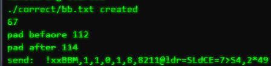

# Multi Connectivity: Half-Duplex

This project is part of the proof of concept Multi Connectivity. The purpose of this project is to validate
new DAB+ messages. With the contained data an acknowledgement needs to be send back with
the use of multiple wireless connections. For more information read the thesis (500770588-Afstudeerrapport-final.docx) on the OneDrive.

## Features

Following features are provided

- Read provided devices and settings from devices.csv
- Observe folder for identifying new DAB+ message
- Read content of DAB+ message
- Sending acknowledgement by AIS, LoRaWAN and 4G
- Supported interfaces: UART, I2C, Socket and SPI

## Requirements

### Libraries

- [Watchdog](https://pypi.org/project/watchdog/)
- [aisutils](https://github.com/schwehr/noaadata) 
- [argparse](https://docs.python.org/3/library/argparse.html)
- [csv](https://docs.python.org/3/library/csv.html)


### Hardware

- Raspberry Pi 4B
- True Heading AIS Class A Base Station
- Sodaq One Rev3
- Pycom FiPy

## Examples

### AIS

#### Requirements
- Connect The True Heading AIS Base Station to the Raspberry Pi by USB
- Add the configuration to the [devices.csv](devices.csv):
````text
name,branch,model,interface_type,address,setting
AIS Base Station, True Heading, Carbon Pro, 0,/dev/ttyusb0,38400
````

#### Send acknowledgement by AIS


1. Run [main.py](main.py) with the following command:
````python
python main.py ./devices.csv ./correct
````

2. Place the [DAB+ message](correct/dabbericht.txt) in the [correct](correct) folder.

3. Watchdog observer detects a new DAB+ message and reads the content.
   
4. The Carbon Pro will be selected to send and acknowledgement.



### Sodaq One

#### Requirements
- Connect the Sodaq One to the Raspberry Pi by I2C
- Add the configuration to the [devices.csv](devices.csv):
````text
name,branch,model,interface_type,address,setting
LoRaWAN Transponder1,Sodaq One,LoRaWAN,1,4,
````

#### Send acknowledgement by LoRaWAN


1. Run [main.py](main.py) with the following command:
````python
python main.py ./devices.csv ./correct
````

2. Place the [DAB+ message](correct/dabbericht.txt) in the [correct](correct) folder.

3. Watchdog observer detects a new DAB+ message and reads the content.
   
4. The Sodaq One will be selected to send and acknowledgement.

### Pycom FiPy

#### Requirements
- Connect the FiPy with static IP, and Raspberry Pi to the same wireless network (Wi-Fi)
- Add the configuration to the [devices.csv](devices.csv):
````text
name,branch,model,interface_type,address,setting
FiPy, Pycom, FiPy, 2,192.168.178.81,6543
````

#### Send acknowledgement by LoRaWAN and 4G (CAT-M1)


1. Run [main.py](main.py) with the following command:
````python
python main.py ./devices.csv ./correct
````

2. Place the [DAB+ message](correct/dabbericht.txt) in the [correct](correct) folder.

3. Watchdog observer detects a new DAB+ message and reads the content.
   
4. The FiPy will be selected to send and acknowledgement.

## To Do

- Better Parent-Child relationship between Interface class and the inferfaces (UART, I2C ect...)